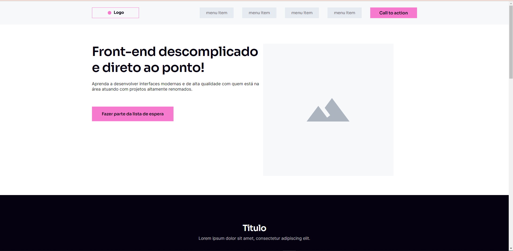

<h1>Projeto-WireFrame</h1>

Projeto para treinar o Media Query

### O desafio

Os usuários devem ser capazes de:

- Veja o layout ideal dependendo do tamanho da tela do dispositivo
- Veja os estados de foco e foco para elementos interativos

### Captura de tela

### Construído com

- Semantic HTML5 markup
- CSS custom properties
- Flexbox
- Media Query
